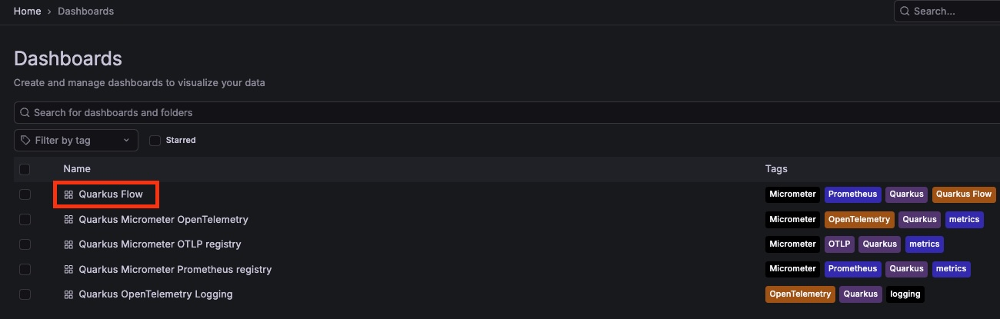
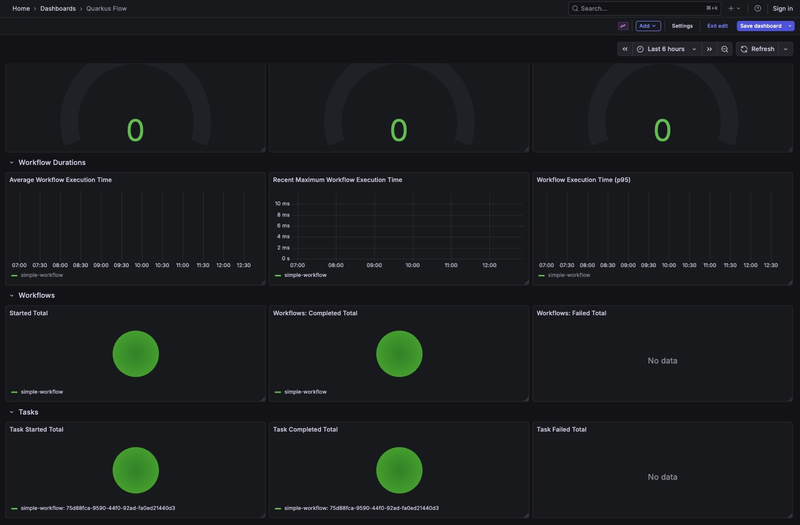
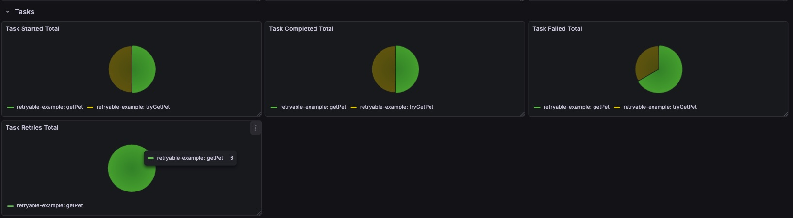
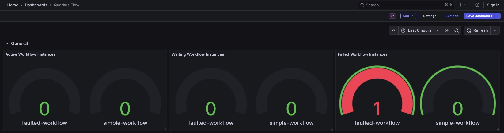

# Workflow Metrics with Micrometer + Grafana Demo (Quarkus Flow)

This guide demonstrates how to configure, export, and visualize **workflow and task metrics**
using **Quarkus Flow**, **Micrometer**, **Prometheus**, and **Grafana**.

It covers multiple workflow scenarios (successful, retried, faulted, and event-driven) and shows
how each one is reflected in metrics and dashboards.

---

## Prerequisites

- JDK 17 or later
- Maven
- Docker **or** Podman (required for LGTM Dev Services)

---

## Project Extensions

This project uses the following Quarkus extensions:

- **io.quarkus:quarkus-observability-devservices-lgtm**  
  Provides a complete local observability stack (Prometheus, Grafana, Tempo, and Loki)
  via Dev Services.

- **io.quarkus:quarkus-smallrye-openapi** (optional)  
  Provides a convenient UI to explore HTTP endpoints and trigger workflows.

- **io.quarkus:quarkus-micrometer-registry-prometheus**  
  Exposes application metrics in Prometheus format.

---

## Running the Example

From the root of the Quarkus Flow project, run:

```bash
cd examples/observability-prometheus
./mvnw quarkus:dev
```

Once the application starts, Prometheus and Grafana are automatically provisioned.

---

## Workflows Overview

This example contains five workflows designed to demonstrate different metrics scenarios:

- **simple-workflow**  
  A basic workflow that sets a JSON payload.

- **retryable-example**  
  A workflow that calls a `GET /pets` endpoint which randomly returns HTTP 500 responses,
  triggering retries.

- **faulted-workflow**  
  A workflow that performs an HTTP call to an unhealthy server and fails.

- **wait-event**  
  A workflow that waits for the event `org.acme.message.received.v1.Message`.

- **emit-event**  
  A workflow that emits the `org.acme.message.received.v1.Message` event, allowing
  the `wait-event` workflow to continue.

---

## Executing Workflows

Start the **simple-workflow**:

```bash
curl -X POST http://localhost:8080/try-workflows/simple
```

---

## Inspecting Prometheus Metrics

Metrics can be inspected in two ways:

1. Via the Prometheus endpoint (`/q/metrics`)
2. Via the Grafana dashboards provided by LGTM Dev Services

### Using the `/q/metrics` Endpoint

Open <http://localhost:8080/q/metrics> in your browser.  
You should see output similar to the following:

```text
# HELP quarkus_flow_workflow_started_total Workflow Started Total
# TYPE quarkus_flow_workflow_started_total counter
quarkus_flow_workflow_started_total{workflow="simple-workflow"} 1

# HELP quarkus_flow_workflow_completed_total Workflow Completed Total
# TYPE quarkus_flow_workflow_completed_total counter
quarkus_flow_workflow_completed_total{workflow="simple-workflow"} 1

# HELP quarkus_flow_task_started_total Task Started Total
# TYPE quarkus_flow_task_started_total counter
quarkus_flow_task_started_total{task="eedefe85-fc39-43f5-a45c-1778e68f926b",workflow="simple-workflow"} 1

# HELP quarkus_flow_task_completed_total Task Completed Total
# TYPE quarkus_flow_task_completed_total counter
quarkus_flow_task_completed_total{task="eedefe85-fc39-43f5-a45c-1778e68f926b",workflow="simple-workflow"} 1
```

All metrics exported by Quarkus Flow use the `quarkus_flow` prefix by default.
This can be customized using the `quarkus.flow.metrics.prefix` configuration property.

---

## Visualizing Metrics with Grafana

To access Grafana:

1. Open the Dev UI at <http://localhost:8080/q/dev-ui>
2. Navigate to **Observability**
3. Click **Grafana UI**
4. Open **Dashboards** → **Quarkus Flow**



Selecting the **Quarkus Flow** dashboard provides a clearer visualization of all metrics:



---

## Generating More Metrics

### retryable-example

Execute this workflow multiple times:

```bash
curl -X POST http://localhost:8080/try-workflows/retryable
```

You should see a dashboard similar to the following:



### Execution Metrics Summary

**Started**
- tryGetPet: 9 executions
- getPet: 9 executions

**Completed**
- tryGetPet: 2 successful executions
- getPet: 2 successful executions

**Failed**
- tryGetPet: 6 failures
- getPet: 12 failures

**Retried**
- getPet: 6 retry attempts

---

### faulted-workflow

Execute:

```bash
curl -X POST http://localhost:8080/try-workflows/faulted
```

The dashboard should display a gauge indicating a workflow failure:



---

### wait-event and emit-event

The **wait-event** workflow pauses execution until an event is received.
The **emit-event** workflow publishes that event, allowing the waiting workflow to resume.

Start the **wait-event** workflow:

```bash
curl -X POST http://localhost:8080/try-workflows/wait-event
```

At this point, the workflow instance enters the `WAITING` state and appears in the
**Waiting Workflow Instances** visualization.

Now emit the required event:

```bash
curl -X POST http://localhost:8080/try-workflows/send-event
```

After the event is processed, the workflow resumes and completes.  
The dashboard will no longer show active or waiting workflow instances.

> **Note:**  
> Metrics synchronization between Prometheus and Grafana may be delayed.
> If metrics do not appear immediately, check the `/q/metrics` endpoint directly.

---

## Workflow Duration Metrics

Workflow durations are exported using a Micrometer **Timer**.

Example configuration in `application.properties`:

```properties
quarkus.flow.tracing.enabled=false
quarkus.flow.metrics.durations.percentiles=0.5,0.95,0.99
```

With this configuration:

- Client-side percentiles are exported as `quantile` time series
- Histogram buckets are exported as `_bucket` metrics

Example output from `/q/metrics`:

```text
# TYPE quarkus_flow_workflow_duration_seconds histogram

# Client-side percentiles (summary-style)
quarkus_flow_workflow_duration_seconds{workflow="wait-event",quantile="0.5"} 14.49
quarkus_flow_workflow_duration_seconds{workflow="wait-event",quantile="0.95"} 14.49
quarkus_flow_workflow_duration_seconds{workflow="wait-event",quantile="0.99"} 14.49

# Histogram buckets
quarkus_flow_workflow_duration_seconds_bucket{workflow="wait-event",le="0.001"} 0
quarkus_flow_workflow_duration_seconds_bucket{workflow="wait-event",le="0.002"} 0
```

The histogram buckets can be used with PromQL functions such as
`histogram_quantile()` to calculate aggregatable percentiles across instances.

---

## Learn More

- Quarkus Micrometer Guide  
  https://quarkus.io/guides/telemetry-micrometer

- Observability Dev Services (LGTM)  
  https://quarkus.io/guides/observability-devservices-lgtm
